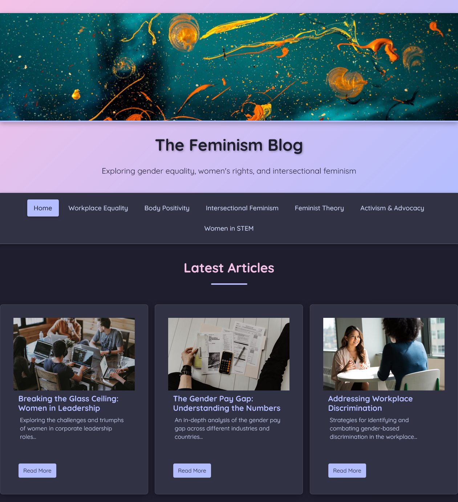

# The Feminism Blog

A concept piece for a modern, accessible blog focused on feminist discourse and education.

## About

The Feminism Blog is a concept website designed to explore various aspects of feminist theory, activism, and contemporary issues. The site features a clean, modern design with a focus on accessibility and user experience.

### Key Features

- Responsive design that works across all devices
- Category-based content organization
- Modern UI with smooth animations
- High-contrast color scheme for better readability
- Image optimization for faster loading
- Semantic HTML for better accessibility

### Categories

- Workplace Equality
- Body Positivity
- Intersectional Feminism
- Feminist Theory
- Activism & Advocacy
- Women in STEM

## Design Philosophy

The website employs the Catppuccin Mocha color scheme, creating a visually appealing and comfortable reading experience. The design prioritizes content readability while maintaining an engaging visual hierarchy.

## Technical Details

- Pure HTML and CSS implementation
- No JavaScript dependencies
- Optimized images using modern formats
- Responsive grid layout
- Mobile-first approach
- Progressive enhancement principles

## Live Demo

Visit the live site at: [https://themany172.github.io/Feminism-Blog---Concept-piece](https://themany172.github.io/Feminism-Blog---Concept-piece)

## Note

This is a concept piece created for educational and demonstration purposes. All content and images are placeholder and sourced from free stock photo websites. 